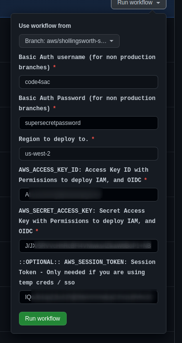
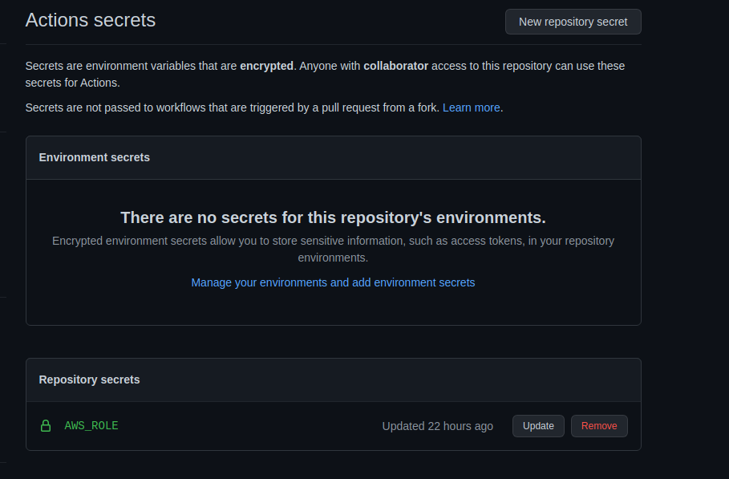
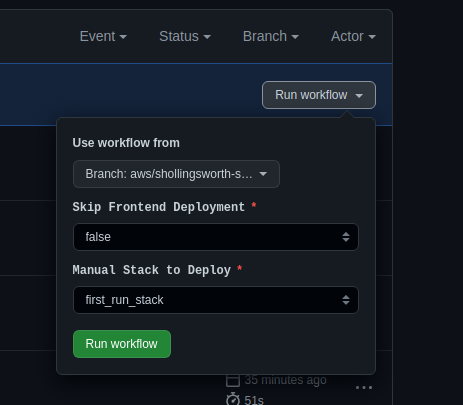

# New AWS Deployment Procedure

Edit the [deploy_map.json](../deploy_map.json) file and add the new deployment to the `deployments` section of the object.
The branch will need to start with `aws/` for the Github deployment process to
work.

using the following project as an example:

```
https://github.com/shollingsworth/trash-ai
                                  ^ `github_repo_name`
                   ^ `github_repo_owner`
```

| Deployment Field Key | Description                                                   |
| -------------------- | ------------------------------------------------------------- |
| aws_account_number   | AWS numerica account number                                   |
| branch               | github branch, if hosted in aws, branch prefix must be `aws/` |
| dns_domain           | Route53 hosted domain name                                    |
| github_repo_name     | github repo name                                              |
| github_repo_owner    | organization / individual owner                               |

---

## Step 1 - Bootstrap AWS Deployment

Start the bootstrap process by going to [the bootstrap workflow](/actions/workflows/bootstrap.yml)

Click `Run Workflow` and select from the following options


---

## Step 2 - Grab the new Github deployment role arn

-   In the AWS Console
    -   Navigate to `Cloudformation` -> `Exports`
    -   Copy the Export Value for key `github-deploy-<region>`

---

## Step 3 - Set ARN value as github repo secret

-   In the Github Repo
    -   Got to the repo `Settings` tab
    -   Select the menu item `Secrets` -> `Actions`
    -   Click `New repository secret`
    -   Secret name will be `AWS_ROLE` \* Secret Value will be the ARN from step 2



---

## Step 4 - Perform first Deployment run

-   In the Github Repo
    -   Run `Manual Actions` -> `Run Workflow`
    -   Select the new deploy branch
    -   Leave skip frontend as false
    -   Select `first_run_stack` as the stack to deploy \* Click `Run Workflow`



---

## Step 5 - While your waiting, set branch protection rule for aws branches

-   In the Github Repo
    -   Go to The `Settings` tab
    -   Select the `branches` menu item
    -   Click `Add rule` in section `Branch protection rules`
    -   Set Pattern as `aws/**`
    -   At a minimum set `Reuire pull request before mergine`
    -   Set any other requirements for branch such as signing commits

---

## Step 6 - Wait

-   Grab a coffee, first run will take ~15 - 20 minutes
