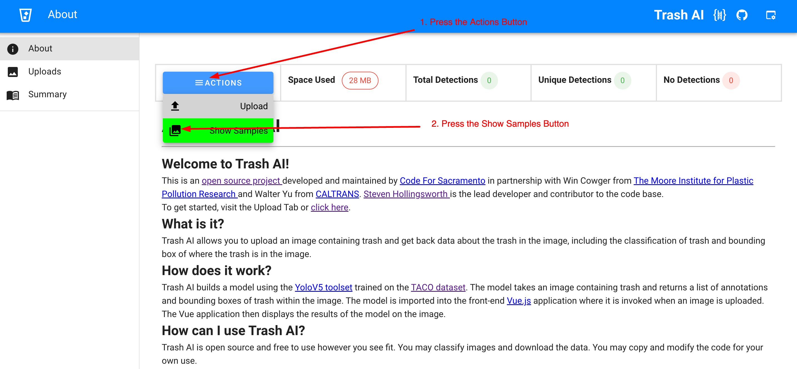
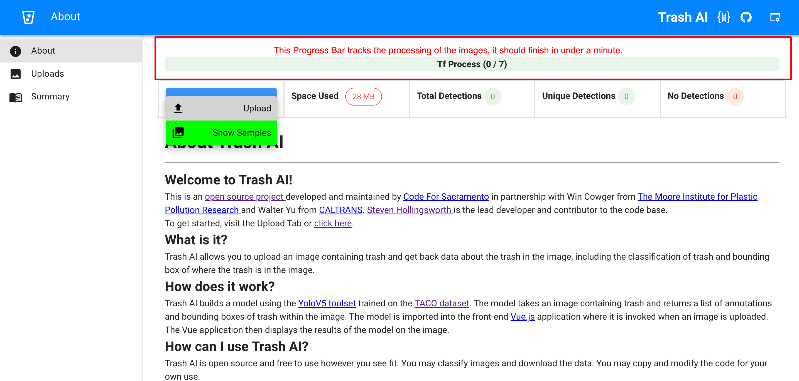
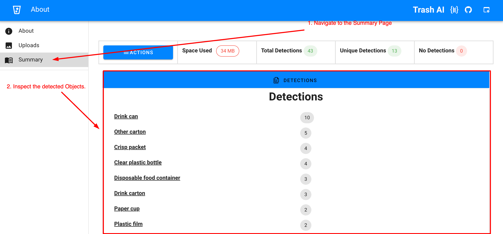
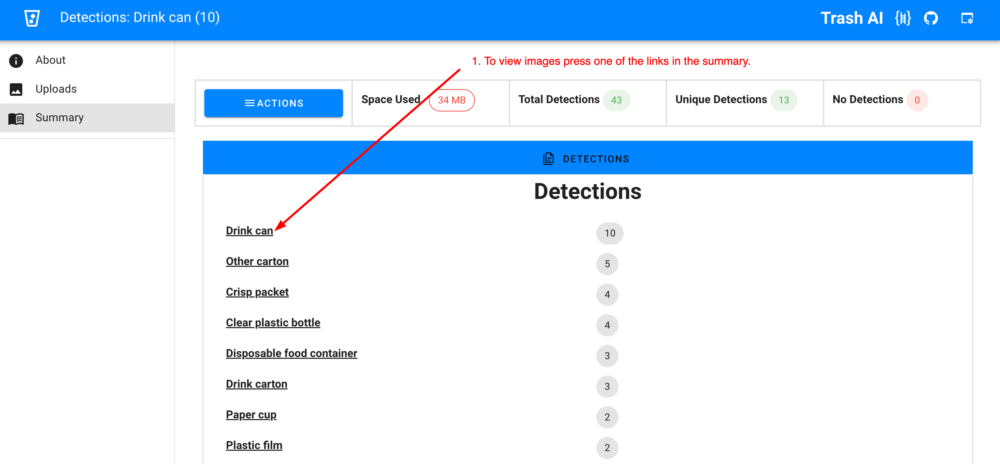
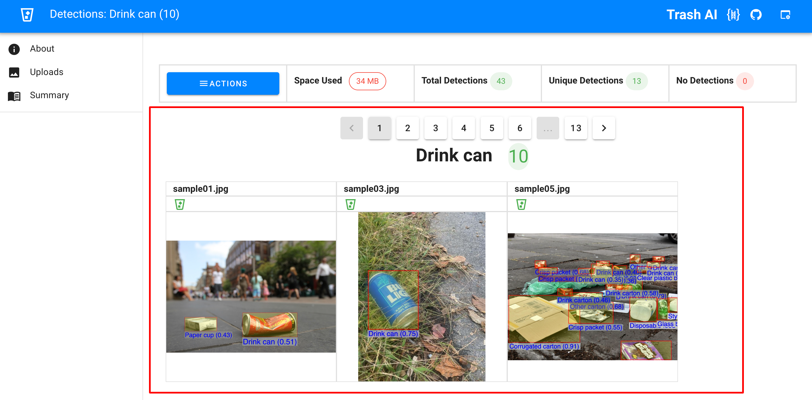
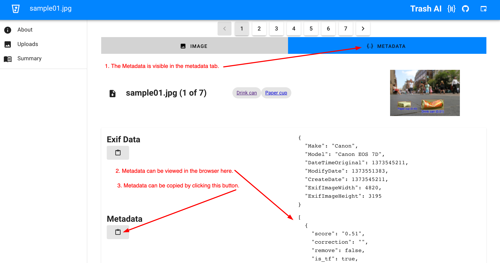

# Tests and Verifications

## Automatic Tests 

### Scenarios
1. Does the landing pag load?
2. On hitting show samples, does processing complete in an expected amount of time? Does it show all the results expected?
3. After recieving results, can you click an image and does the page show the expected data/metadata/etc?
4. After recieving results, does the summary page contain the correct data?

## How to run

1. Navigate to `frontend/`
2. Run `yarn install`
2. Spin up docker container
`docker-compose up`
3. Run the auto tests
`yarn run jest`

## Manual Tests

1. Does the landing pag load?

When you open the landing page. Either at https://www.trashai.org/ or http://localhost:5150

The page should loads in a reasonable timeframe. (<2 seconds)

*You can use the `Network` tab in the dev tools for more fine grained analysis.*

2. On hitting show samples, does processing complete in an expected amount of time? Does it show all the results expected?

When the show samples button is pressed. (as depicted below)

Then the app will start processing images. (as depcited below)

*The processing should be relatively quick, it it takes more than a minute, something is definetly wrong.*

When the processing is done, the results will be available in the summary page.

It should be populated like above.

3. After recieving results, can you click an image and does the page show the expected data/metadata/etc?

When one of the links in the summary table is clicked. 

Then the images will be displayed along with the segmentation and classes detected. 

When the METADATA tab is opened, the relevant metadata for the image is displayed. 

4. After recieving results, does the summary page contain the correct data?

*The summary page shows the results of processing a random sample of images, as long as it's not empty it can be considered as correct.*